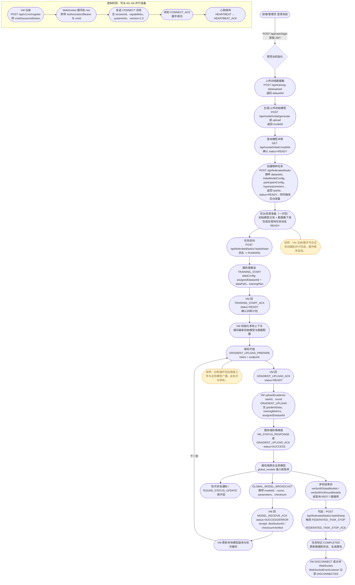

# 联邦学习端到端流程图

```mermaid
flowchart TD
    A0([前端/管理员 登录系统]) -->|POST /api/user/login<br/>获取 JWT| A1{管控台初始化}
    A1 --> A2([上传训练数据集<br/>POST /api/training-data/upload<br/>返回 datasetId])
    A2 --> A3([生成/上传初始模型<br/>POST /api/model/initial/generate 或 upload<br/>返回 modelId])
    A3 --> A4([查询模型详情<br/>GET /api/model/initial/:modelId<br/>确认 status=READY])

    A4 --> A5([创建联邦任务<br/>POST /api/federated/tasks<br/>携带 datasetId、initialModelConfig、participantConfig、hyperparameters…<br/>返回 taskId，status=READY，同时触发后台准备])
    A5 --> A6([后台资源准备（一次性）<br/>初始模型分发 + 数据集下发<br/>完成后保持任务状态 READY])
    A6 --> A7([任务启动<br/>POST /api/federated/tasks/:taskId/start<br/>状态 -> RUNNING])

    subgraph VM_Side["虚拟机侧 - 可与 A0~A6 并行准备"]
        B0([VM 注册<br/>POST /api/v1/vm/register<br/>得 vmId/sessionId/token]) --> 
        B1([WebSocket 握手到 /ws<br/>附带 Authorization/Bearer 与 vmId])
        B1 --> B2([发送 CONNECT 消息<br/>含 sessionId、capabilities、systemInfo、version=1.5])
        B2 --> B3([收到 CONNECT_ACK<br/>握手成功])
        B3 --> B4([心跳维持<br/>HEARTBEAT ↔ HEARTBEAT_ACK])
    end

    A7 --> C0([服务端推送 TRAINING_START<br/>dataConfig: assignedDatasetId + dataPath，trainingPlan])
    C0 --> C1([VM 回 TRAINING_START_ACK<br/>status=READY<br/>确认训练计划])
    C1 --> C2([VM 初始化本地上下文<br/>缓存最新初始模型与数据配置])

    %% 训练轮次循环
    C2 --> D0([每轮开始<br/>GRADIENT_UPLOAD_PREPARE<br/>token + endpoint])
    D0 --> D1([VM 回 GRADIENT_UPLOAD_ACK<br/>status=READY])
    D1 --> D2([VM uploadGradients: taskId、round<br/>GRADIENT_UPLOAD<br/>含 gradientData、trainingMetrics、assignedDatasetId])
    D2 --> D3([服务端存储梯度<br/>VM_STATUS_RESPONSE 或 GRADIENT_UPLOAD_ACK · status=SUCCESS])
    D3 --> D4([服务端聚合全局模型<br/>global_models 插入新版本])
    D4 --> D5([GLOBAL_MODEL_BROADCAST<br/>携带 modelId、round、parameters、checksum])
    D5 --> D6([VM 回 MODEL_RECEIVE_ACK<br/>status=SUCCESS/ERROR<br/>receipt: distributionId / checksumVerified])
    D6 --> D7([VM 更新本地模型副本与轮次缓存])
    D7 -->|下一轮| D0

    %% 监控与收尾
    D4 --> F0([轮次状态通知 / ROUND_STATUS_UPDATE · 若开启])
    D4 --> G0([多轮结束后<br/>verifyAllGlobalModels / verifyAllVmRoundModels<br/>或查询 REST / 数据库])

    G0 --> H0([可选：POST /api/federated/tasks/:taskId/stop<br/>触发 FEDERATED_TASK_STOP → FEDERATED_TASK_STOP_ACK])
    H0 --> H1([任务标记 COMPLETED<br/>更新数据库状态、生成报告])
    H1 --> H2([VM DISCONNECT 或关闭 WebSocket<br/>WebSocketEventListener 记录 DISCONNECTED])

    %% 备注
    classDef note fill:#fff3cd,stroke:#f0ad4e,color:#8a6d3b;
    Note1([说明：VM 注册/握手可在任务创建前并行完成，图中顺序呈现。]):::note
    Note2([说明：训练循环包含梯度上传与全局模型广播，此处示为单轮。]):::note
    A6 --- Note1
    D0 --- Note2
```
