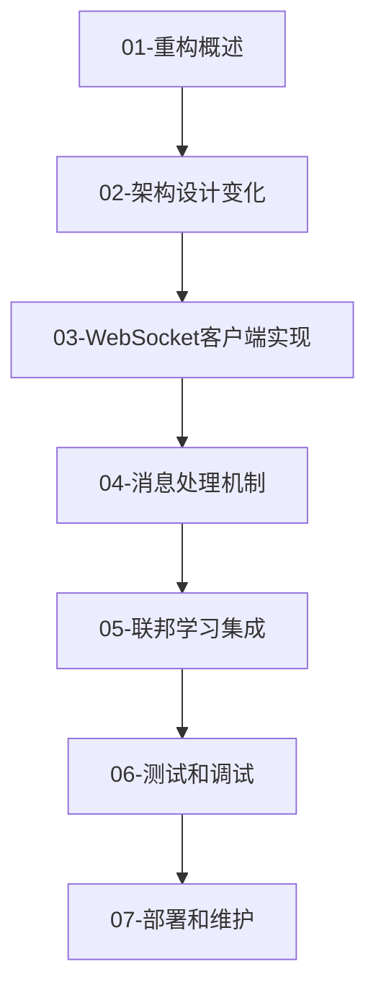

# Python 虚拟机 WebSocket 协议重构文档

本目录包含 Python 虚拟机从现有 STOMP 协议到 WebSocket 协议 v1.4 的完整重构指导文档。

## 📋 文档概览

### 🎯 核心指导文档
1. **[重构概述](./01-refactor-overview.md)** - 协议升级背景、目标和实施策略
2. **[架构设计变化](./02-architecture-design.md)** - 角色转换、模块重构和多任务管理
3. **[WebSocket 客户端实现](./03-websocket-client.md)** - 客户端连接、任务管理和错误处理
4. **[消息处理机制](./04-message-handling.md)** - 消息路由、协议处理和状态管理
5. **[联邦学习集成](./05-federated-learning-integration.md)** - 训练执行器、算法适配和性能优化
6. **[测试和调试](./06-testing-debugging.md)** - 测试策略、调试工具和故障排除
7. **[部署和维护](./07-deployment-maintenance.md)** - 生产部署、监控和运维管理

## 🚀 快速开始

### 1. 重构前准备
在开始重构之前，请确保：
- 理解新的中心化架构设计理念
- 熟悉 WebSocket 协议 v1.4 的消息结构
- 备份现有代码和配置

### 2. 阅读顺序建议


**推荐学习路径**:
1. **第一步**: 阅读 [重构概述](./01-refactor-overview.md) 了解协议升级背景和目标
2. **第二步**: 学习 [架构设计变化](./02-architecture-design.md) 理解新的中心化架构
3. **第三步**: 参考 [WebSocket 客户端实现](./03-websocket-client.md) 进行连接管理代码重构
4. **第四步**: 实现 [消息处理机制](./04-message-handling.md) 的路由和协议处理
5. **第五步**: 集成 [联邦学习功能](./05-federated-learning-integration.md) 实现训练执行
6. **第六步**: 按照 [测试和调试指导](./06-testing-debugging.md) 验证实现正确性
7. **第七步**: 根据 [部署和维护](./07-deployment-maintenance.md) 上线生产环境

### 3. 实施时间计划
```bash
# 🕐 阶段1: 协议适配层 (1-2周)
# - 保留现有接口，新增 v1.4 协议支持
# - 实现协议转换层和兼容性测试
# 📚 重点文档: 01-重构概述, 02-架构设计变化

# 🕑 阶段2: 核心重构 (2-3周)
# - WebSocket 客户端重写
# - 消息处理重构，状态管理简化
# 📚 重点文档: 03-WebSocket客户端实现, 04-消息处理机制

# 🕒 阶段3: 功能完善 (1-2周)
# - 多任务支持完善
# - 异常处理优化，性能调优
# 📚 重点文档: 05-联邦学习集成, 06-测试和调试

# 🕓 阶段4: 清理和优化 (1周)
# - 移除旧代码，文档更新
# - 最终测试和生产部署
# 📚 重点文档: 06-测试和调试, 07-部署和维护
```

## 🏗️ 架构设计原则

### 核心理念
- **后端作为"大脑"**: 控制所有状态管理、决策逻辑、任务编排
- **Python VM 作为"手脚"**: 只响应后端指令，执行训练，上报结果
- **精确任务控制**: 通过 taskId 实现任务级别的精确控制
- **多任务支持**: 单台虚拟机可同时执行多个联邦学习任务

### 简化设计
- 移除 STOMP 协议复杂性
- 采用 JSON 格式的直接 WebSocket 通信
- 专注核心训练流程，移除不必要的协商

## 🔧 技术特性

### WebSocket 协议 v1.4 支持
- **34 个核心协议消息**: 覆盖完整的联邦学习生命周期
- **中心化状态管理**: 所有状态由后端统一维护和控制
- **简化消息流**: 移除复杂的协商和配置消息

### 联邦学习支持
- **多算法支持**: FEDERATED_AVERAGING、FEDERATED_PROXIMAL、FEDERATED_NOVA、SCAFFOLD
- **多数据类型**: ACOUSTIC、ENVIRONMENT、MODEL、OTHER、TEST_DATA、SPECIAL_CHARS、LONG_TEXT
- **任务级控制**: 通过 taskId 实现精确的任务管理和多任务并发
- **动态参与者管理**: 支持虚拟机的动态加入和退出

## 📊 重构收益

### 开发效率提升
- ✅ 减少 70% 的协议处理代码
- ✅ 简化状态管理逻辑
- ✅ 提高代码可维护性

### 系统稳定性增强
- ✅ 集中化控制减少错误
- ✅ 简化的异常处理机制
- ✅ 更好的错误恢复能力

### 功能扩展能力
- ✅ 支持多任务并发执行
- ✅ 更灵活的算法支持
- ✅ 更好的资源利用率

## 🧪 测试策略

### 单元测试
- WebSocket 客户端连接和消息处理
- 任务上下文管理和生命周期
- 消息路由和错误处理

### 集成测试
- 与后端的完整通信流程
- 多任务并发执行验证
- 异常场景恢复测试

### 性能测试
- 并发任务处理能力
- 内存和 CPU 使用优化
- 网络通信效率

## 🚨 重要注意事项

### ⚠️ 兼容性
- 现有数据库结构保持兼容
- ML 模块接口保持稳定
- 配置文件格式向后兼容

### ⚠️ 安全性
- 认证令牌安全传输
- 敏感信息加密存储
- 网络通信加密

### ⚠️ 性能考虑
- 避免内存泄漏
- 优化梯度传输大小
- 合理设置并发限制

## 📚 文档结构详解

### 🏗️ 架构和设计类文档
- **[01-重构概述](./01-refactor-overview.md)**: 协议升级背景、v1.4 优势对比、4阶段实施策略
- **[02-架构设计变化](./02-architecture-design.md)**: 中心化架构设计、模块重构、多任务管理架构

### 💻 实现和开发类文档
- **[03-WebSocket客户端实现](./03-websocket-client.md)**: FederatedLearningClient 完整实现、连接管理、任务上下文
- **[04-消息处理机制](./04-message-handling.md)**: MessageRouter 设计、34个协议消息处理、状态管理
- **[05-联邦学习集成](./05-federated-learning-integration.md)**: 训练执行器、算法适配器、性能优化策略

### 🧪 测试和运维类文档
- **[06-测试和调试](./06-testing-debugging.md)**: 单元测试、集成测试、调试工具、故障排除指南
- **[07-部署和维护](./07-deployment-maintenance.md)**: 生产部署、容器化、K8s配置、监控运维

## 🔗 相关文档

### WebSocket 协议规范
- [WebSocket协议文档-中心化-简化.md](../shared/api/WebSocket/WebSocket协议文档-中心化-简化.md) - v1.4 协议规范（主要参考）
- [WebSocket消息格式定义.md](../shared/api/WebSocket/WebSocket消息格式定义.md) - 消息格式和字段定义

### 实现示例文档
- [联邦学习完整流程.md](../shared/api/WebSocket/example/联邦学习完整流程.md) - 基于 v1.4 协议的完整工作流程
- [虚拟机职责与实现要求.md](../shared/api/WebSocket/example/虚拟机职责与实现要求.md) - VM 执行器职责定义
- [消息时序图.md](../shared/api/WebSocket/example/消息时序图.md) - 简化后的消息时序图

### 系统架构文档
- [数据库架构文档](../shared/database/database_schema.md) - 数据库表结构设计
- [联邦学习API参考](../shared/api/HTTP/federated-task-api-reference.md) - HTTP API接口规范

## 🛠️ 开发工具

### 调试工具
- WebSocket 消息跟踪器
- 性能监控器
- 健康检查脚本

### 部署工具
- 配置管理器
- 服务启动脚本
- systemd 服务文件

## 🎯 使用指南

### 🔍 快速查找指南
根据你的具体需求，快速定位到相关文档：

| 需求 | 推荐文档 | 章节 |
|-----|---------|------|
| 了解重构背景和动机 | [01-重构概述](./01-refactor-overview.md) | 1.1 现有协议问题 |
| 理解新架构设计理念 | [02-架构设计变化](./02-architecture-design.md) | 2.1 角色转换 |
| 实现WebSocket连接 | [03-WebSocket客户端实现](./03-websocket-client.md) | 3.1 FederatedLearningClient |
| 处理协议消息 | [04-消息处理机制](./04-message-handling.md) | 4.1 MessageRouter |
| 集成训练算法 | [05-联邦学习集成](./05-federated-learning-integration.md) | 2.1 FederatedTrainingExecutor |
| 编写测试代码 | [06-测试和调试](./06-testing-debugging.md) | 2.1 WebSocket客户端测试 |
| 生产环境部署 | [07-部署和维护](./07-deployment-maintenance.md) | 2.1 单机部署 |
| 故障排除 | [06-测试和调试](./06-testing-debugging.md) | 6.1 常见问题和解决方案 |

### 📋 检查清单

#### 重构前准备
- [ ] 备份现有代码和配置
- [ ] 阅读完整的 [重构概述](./01-refactor-overview.md)
- [ ] 理解 [架构设计变化](./02-architecture-design.md) 的核心理念
- [ ] 准备开发和测试环境

#### 实施过程
- [ ] 按照 [WebSocket客户端实现](./03-websocket-client.md) 重写客户端
- [ ] 根据 [消息处理机制](./04-message-handling.md) 实现消息路由
- [ ] 参考 [联邦学习集成](./05-federated-learning-integration.md) 集成训练功能
- [ ] 执行 [测试和调试](./06-testing-debugging.md) 中的测试策略

#### 部署前验证
- [ ] 完成所有单元测试和集成测试
- [ ] 运行端到端测试验证完整流程
- [ ] 执行性能测试确保满足要求
- [ ] 按照 [部署和维护](./07-deployment-maintenance.md) 准备生产环境

## 📞 支持和反馈

### 🚨 遇到问题时的处理步骤

1. **🔍 查阅相关文档**:
   - 技术问题: 查看 [测试和调试](./06-testing-debugging.md)
   - 部署问题: 参考 [部署和维护](./07-deployment-maintenance.md)
   - 架构问题: 回顾 [架构设计变化](./02-architecture-design.md)

2. **🔧 运行诊断工具**:
   ```bash
   # 健康检查
   python health_check.py --server-url ws://server:8080/websocket --token your_token

   # WebSocket连接调试
   python debug_websocket.py --uri ws://server:8080/websocket --token your_token --vm-id your_vm_id

   # 日志分析
   python analyze_logs.py federated_learning.log
   ```

3. **📋 收集信息**:
   - 系统信息 (OS版本、Python版本)
   - 错误日志和堆栈跟踪
   - 配置文件内容
   - 网络连接状态

4. **📚 查看故障排除指南**: [06-测试和调试](./06-testing-debugging.md#6-故障排除指南)

### 🤝 贡献指南
如果你在使用过程中发现文档错误或有改进建议：
1. 记录具体的问题描述和改进建议
2. 提供相关的代码示例或配置文件
3. 说明你的使用场景和环境信息

---

**⚠️ 重要提醒**: 本重构指导基于 WebSocket 协议 v1.4 和中心化架构设计。在实施前请确保：
- 理解新架构的设计理念和技术要求
- 具备相应的 Python 开发和 WebSocket 技术基础
- 准备充分的测试环境和回滚方案
