# 联邦学习WebSocket消息时序图

本文档详细描述了基于WebSocket协议v1.5的联邦学习消息时序，严格遵循"后端控制一切，虚拟机只执行"的简化架构设计。v1.5版本引入了13步标准化流程和数据集关联管理功能。

## 1. 核心设计理念

### 1.1 v1.5简化原则
- **后端主导**: 所有时序控制都由后端发起和管理
- **虚拟机被动**: 虚拟机只响应后端指令，不主动发起流程
- **任务隔离**: 通过taskId实现精确的任务级控制
- **流程简化**: 移除复杂的协商和通知机制
- **数据集管理**: 🆕 统一的assignedDatasetId管理机制

### 1.2 v1.5时序特点
- **同步启动**: 后端确保所有虚拟机同步进入下一阶段
- **状态透明**: 虚拟机状态对后端完全可见
- **自动流转**: 训练完成后自动上传梯度，无需额外指令
- **数据集确认**: 🆕 数据集分发后主动确认创建状态
- **13步标准化**: 🆕 完整的4步启动+9步轮次循环

## 2. 完整联邦学习时序

### 2.1 v1.5总体时序图 (13步标准化流程)

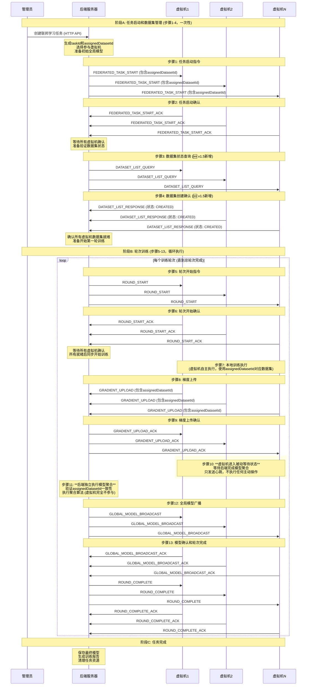

## 3. 详细阶段时序

### 3.1 任务启动阶段

#### 3.1.1 任务创建和启动
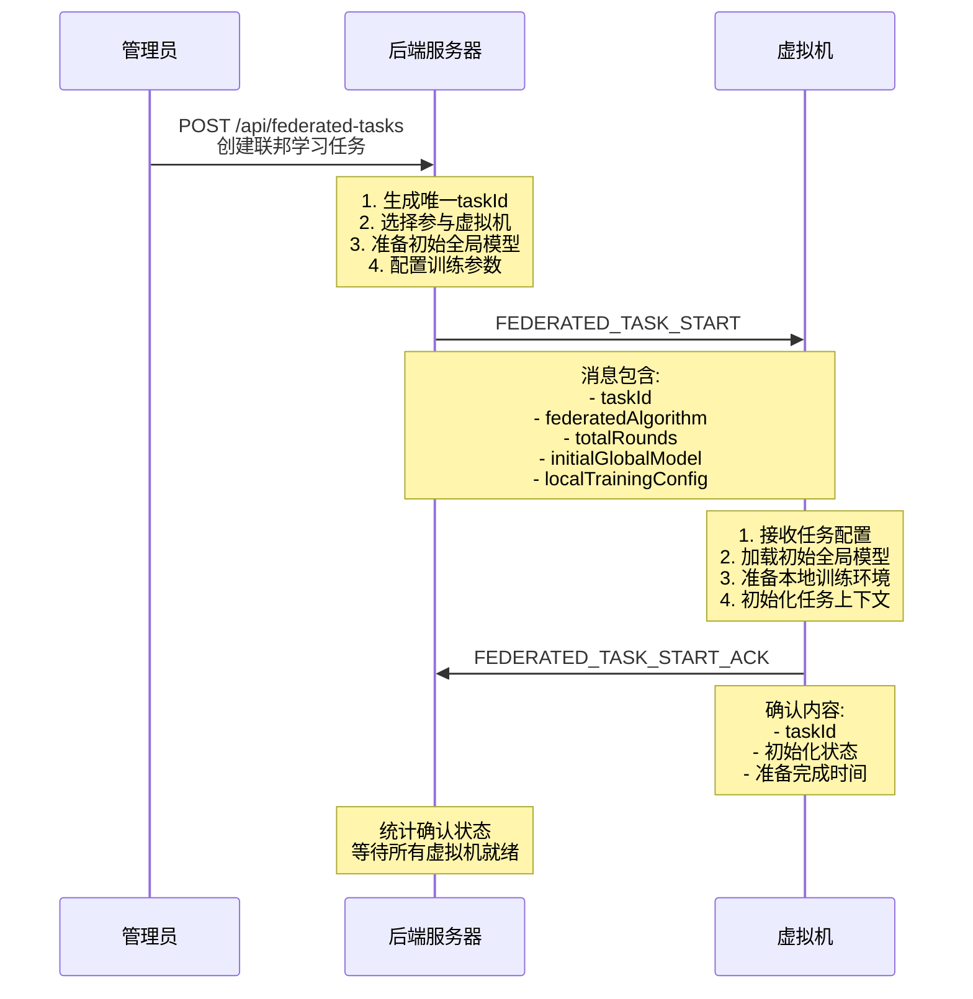

**时序要求**:
- 任务启动消息发送间隔: < 1秒
- 虚拟机初始化超时: 30秒
- 所有虚拟机就绪检查间隔: 2秒

#### 3.1.2 第一轮训练触发
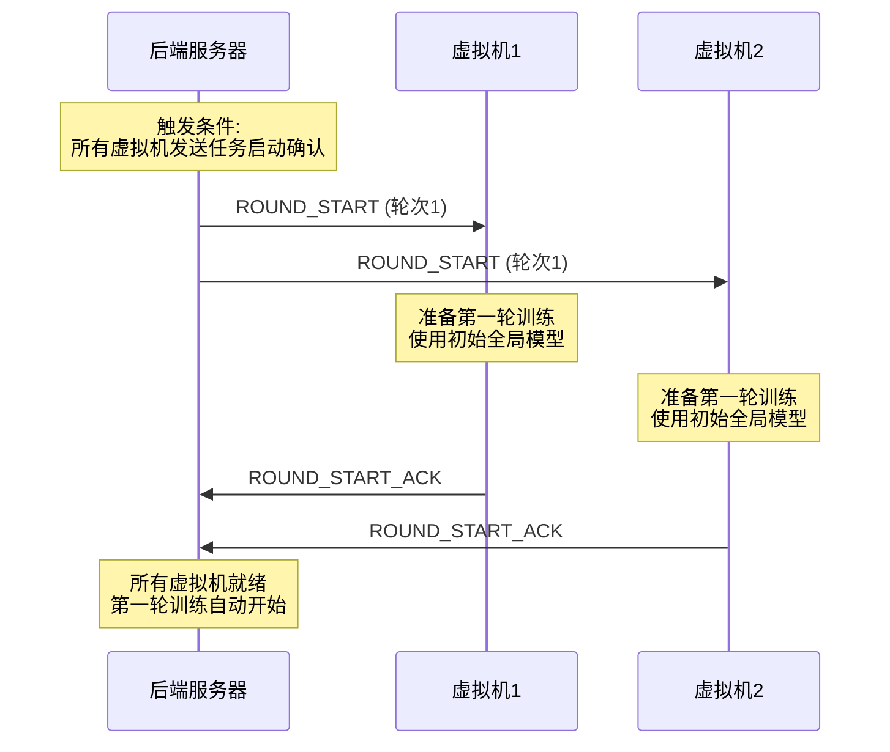

### 3.2 轮次训练时序

#### 3.2.1 轮次开始同步
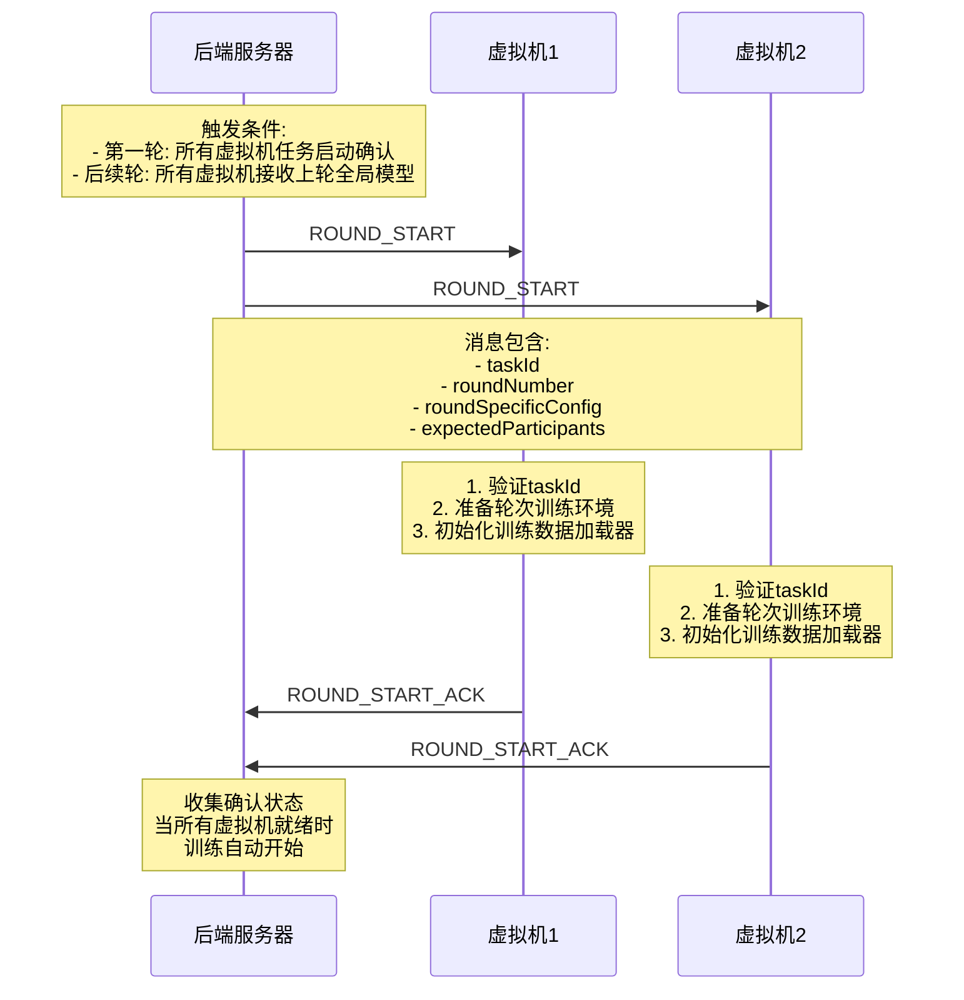

#### 3.2.2 本地训练执行和虚拟机等待
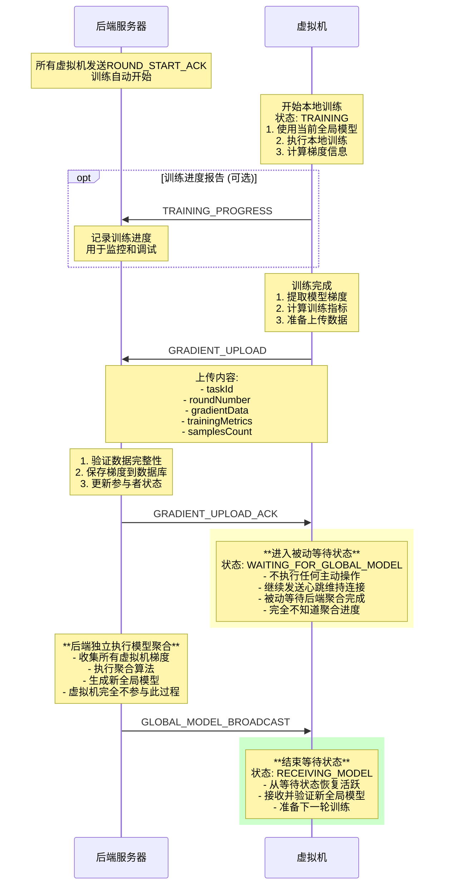

**时序要求**:
- 轮次启动确认超时: 60秒
- 本地训练超时: 可配置 (通常10-30分钟)
- 梯度上传超时: 5分钟

### 3.3 模型聚合时序

#### 3.3.1 聚合触发和执行
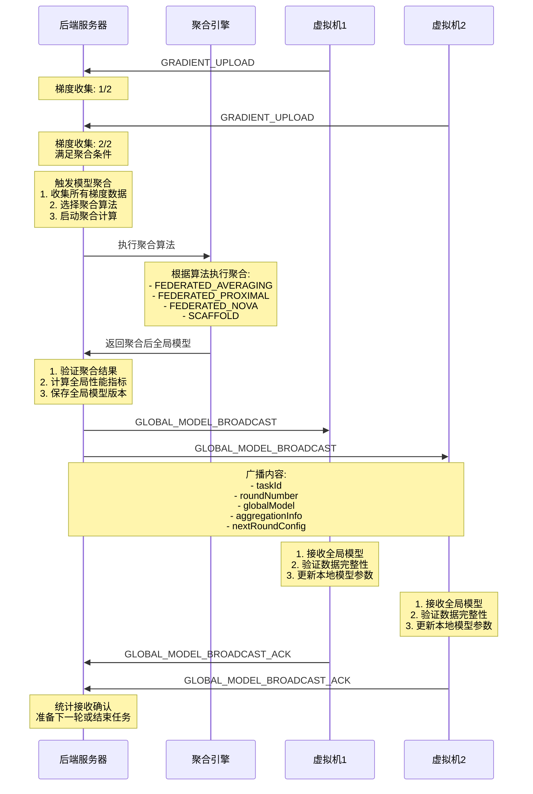

#### 3.3.2 轮次完成通知
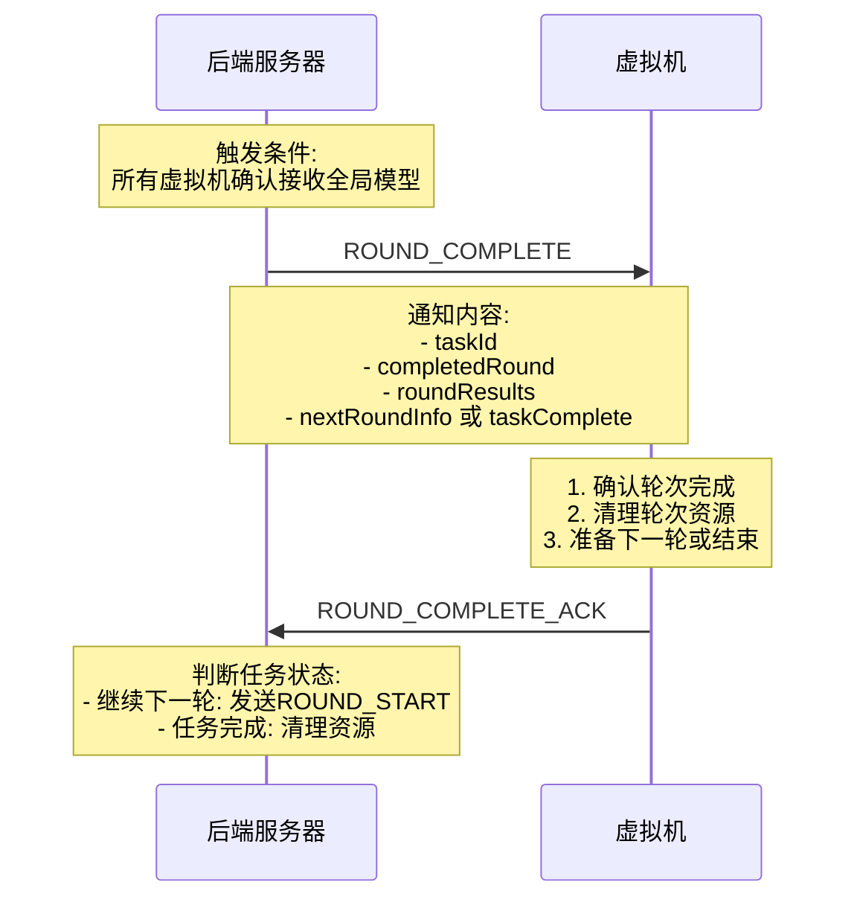

### 3.4 心跳和状态监控

#### 3.4.1 心跳机制
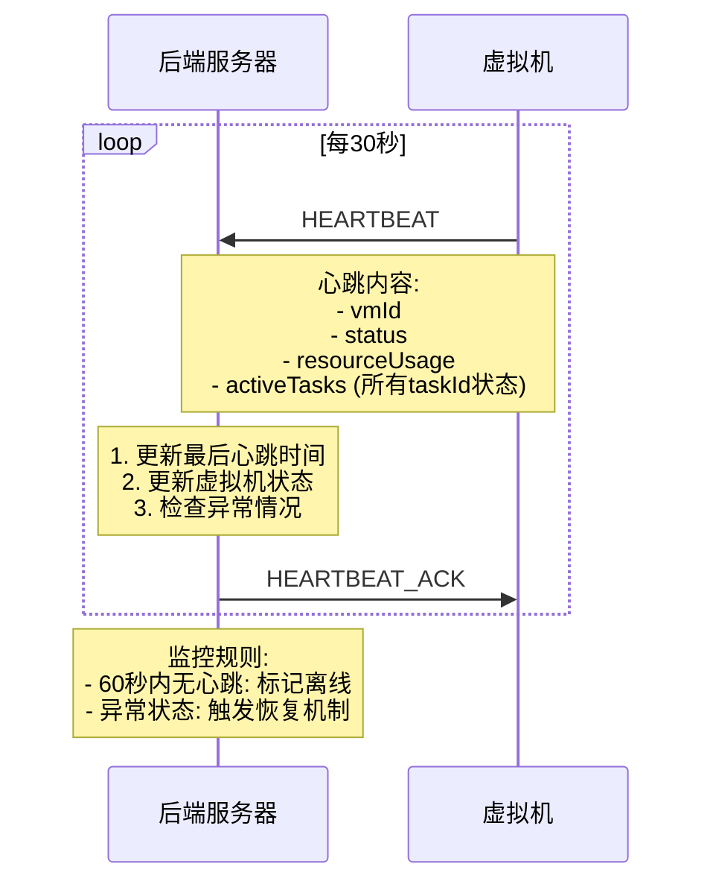

#### 3.4.2 多任务状态监控
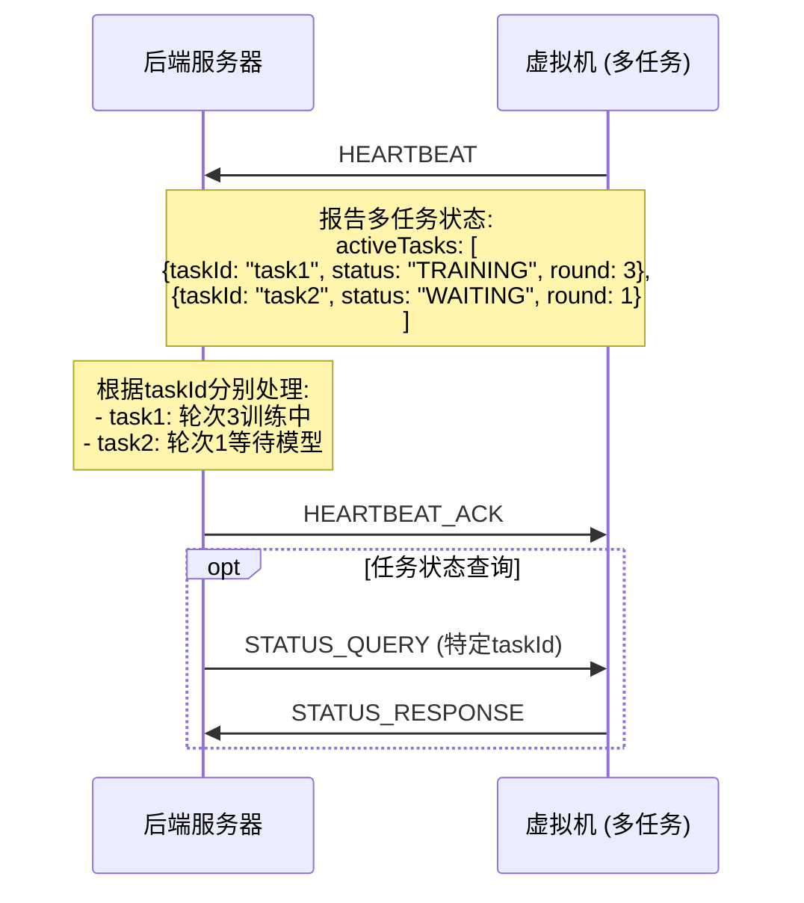

## 4. 异常情况时序

### 4.1 虚拟机超时处理

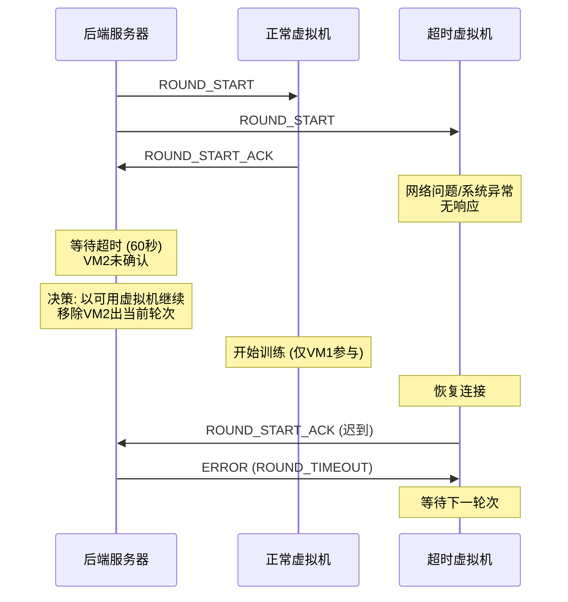

### 4.2 网络中断恢复

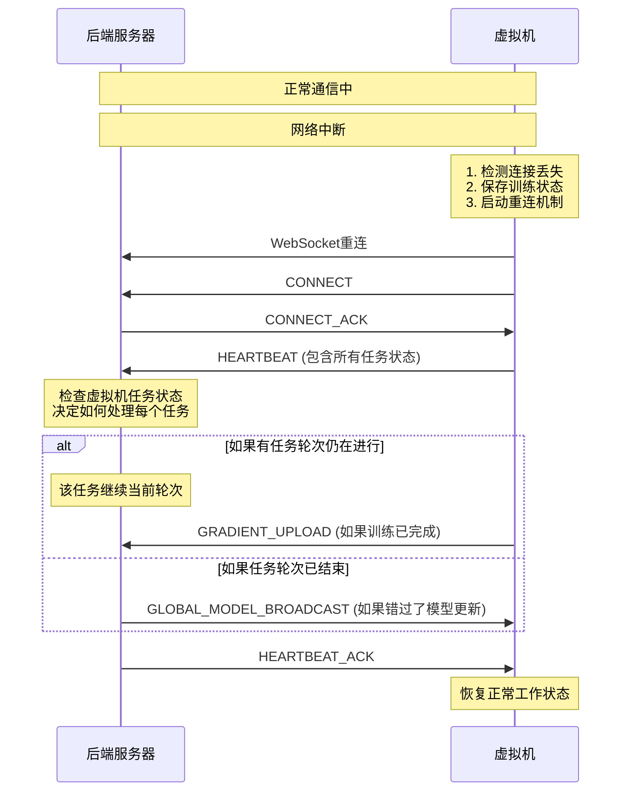

### 4.3 聚合失败处理

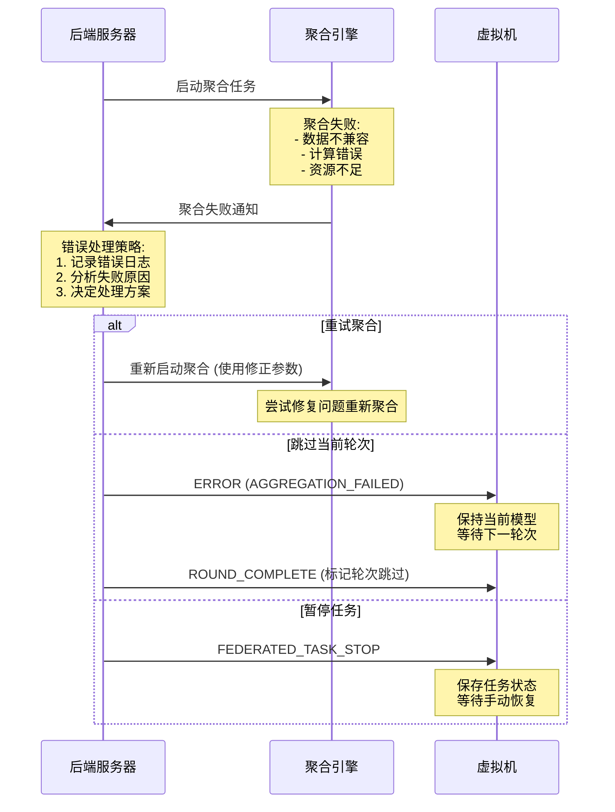

## 5. 多任务并发时序

### 5.1 单虚拟机多任务执行

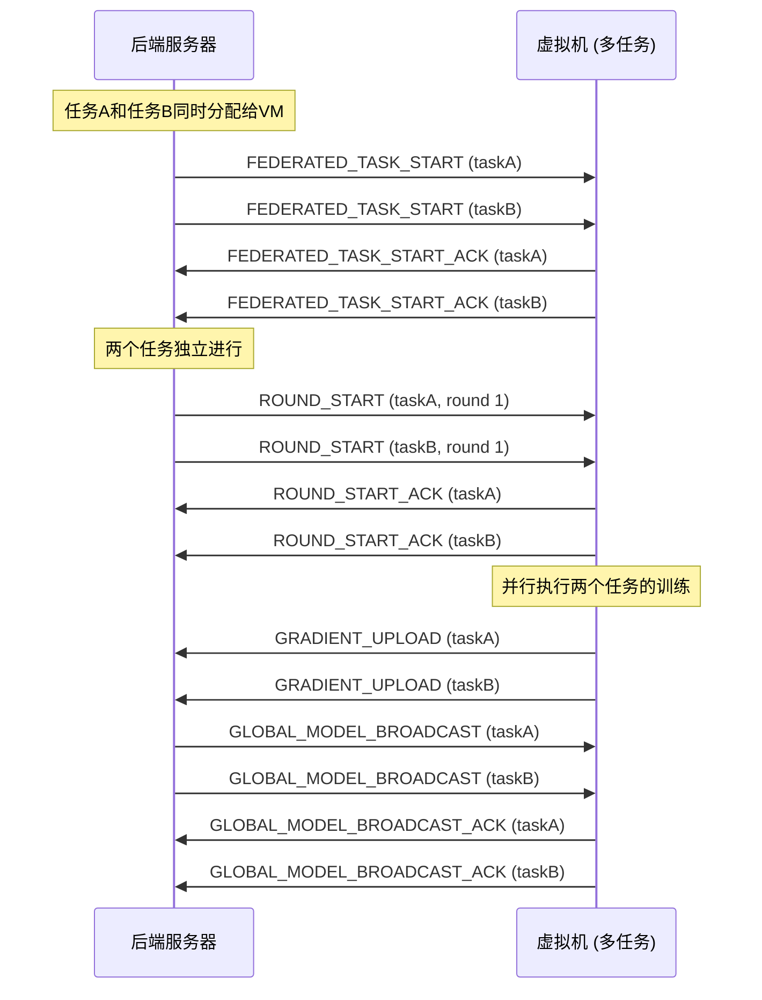

## 6. 性能优化和监控

### 6.1 消息批处理优化

```javascript
// 心跳消息批量报告多任务状态
const batchHeartbeat = {
    "type": "HEARTBEAT",
    "vmId": "vm-001",
    "data": {
        "status": "ACTIVE",
        "resourceUsage": {...},
        "activeTasks": [
            {"taskId": "task1", "status": "TRAINING", "progress": 0.6},
            {"taskId": "task2", "status": "WAITING", "progress": 1.0}
        ]
    }
};

// 批量梯度上传确认
const batchUploadAck = {
    "type": "BATCH_GRADIENT_UPLOAD_ACK",
    "confirmations": [
        {"taskId": "task1", "roundNumber": 3, "status": "SUCCESS"},
        {"taskId": "task2", "roundNumber": 1, "status": "SUCCESS"}
    ]
};
```

### 6.2 时序监控指标

**关键时序指标**:
- 任务启动时间: 从HTTP创建到第一轮开始
- 轮次同步时间: 从ROUND_START到所有ACK
- 训练执行时间: 从轮次开始到梯度上传
- 聚合执行时间: 从收集完梯度到模型广播
- 端到端轮次时间: 完整轮次的总时间

**监控实现**:
```javascript
class TimingMonitor {
    constructor() {
        this.metrics = new Map();
    }

    startTiming(taskId, phase, round = null) {
        const key = `${taskId}-${phase}-${round || 'global'}`;
        this.metrics.set(key, {
            startTime: Date.now(),
            taskId, phase, round
        });
    }

    endTiming(taskId, phase, round = null) {
        const key = `${taskId}-${phase}-${round || 'global'}`;
        const metric = this.metrics.get(key);
        if (metric) {
            metric.duration = Date.now() - metric.startTime;
            metric.endTime = Date.now();
            return metric.duration;
        }
        return null;
    }
}
```

这个简化的时序图确保了联邦学习在"后端大脑，虚拟机手脚"架构下的高效执行，所有复杂的协调逻辑都由后端控制，虚拟机专注于执行训练任务。